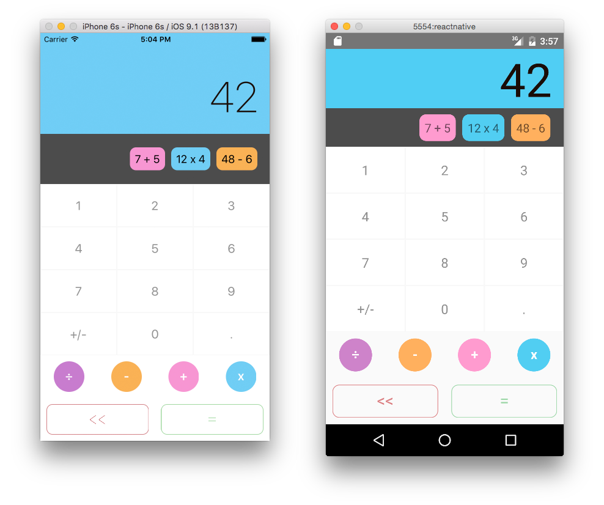

# iOS & Android Mobile website Apps with the same code

This project shows how the source code can be architectured to run on multiple devices. As of now, it is able to run as:

- iOS & Android Apps (based on react-native)
- a Website App in any browser (based on react)

## Screenshots

### Mobile Apps (iOS & Android)



## Libraries/tools

This project uses libraries and tools like:
- es6 syntax and [babel](https://babeljs.io)
- [react](https://facebook.github.io/react) for the Website App and Desktop App,
- [react-native](https://facebook.github.io/react-native) for the iOS & Android Apps
- [flux](https://facebook.github.io/flux) to organize the data flow management
- [css-loader](https://github.com/webpack/css-loader) to integrate the styles in the builds
- [grunt](http://gruntjs.com) to create the builds
- [webpack](https://webpack.github.io) to help during the development phase with hot reloading

## Basic philosophy

### Components

The real interest of the project is in how the components have been structured to shared most of their logic and only redefined what is specific to every device.

Basically, every component has a main `Class` which inherits a base `Class` containing all the logic. Then, the main component import a different Render function which has been selected during the build. The file extension `.ios.js`, `.android.js` or `.js` is used by the build tool to import only the right file.

The `.native.js` files contain code that is shared between both mobile platforms (iOS & Android). Currently, the `.ios.js` and `.android.js` files compose this `.native.js` file since all code is shared right now. However, if a component needed to be different for platform specific reasons, that code would be included in the corresponding platform specific files.

At the end, every component is defined by 6 files. If we look at the screen component, here is its structure.

```
Screen.js
├── ScreenBase.js
├── ScreenRender.ios.js (specific to iOS build
├── ScreenRender.android.js (specific to Android build)
├── ScreenRender.native.js (shared mobile app code - iOS & Android)
└── ScreenRender.js (used during Website and Desktop build)
```

And here is the main `Class` file which composes the files.

```js
'use strict';

import Base from './ScreenBase';
import Render from './ScreenRender';

export default class Screen extends Base {
  constructor (props) {
    super(props);
  }

  render () {
    return Render.call(this, this.props, this.state);
  }
}
```

# How to build/run the projects

## General requirements before running any specific project

- `npm install` to install all the dependencies, React and React Native among others.

### With some versions of npm (>=v3.3.10 <=v3.7.0)

Some builds from npm included bugs while `npm install`. So if you are using a npm version within the range form 3.3.10 to 3.7.0 included, you must run `npm install` twice. Those versions including npm v3.3.12 are the ones bundled by default with node from version v5.2.0 to v5.5.0.

- `npm install npm`
- `npm install npm` run it twice, because of the packages won't be installed after the first run [#10985](https://github.com/npm/npm/issues/10985)

## The Mobile Apps (iOS & Android)

### Requirements for React Native

#### iOS

- OS X
- Xcode 7.3 or higher is recommended (Xcode only runs on Mac).
- We used Homebrew to install node, watchman, and flow.
- `brew install node`
- `brew install watchman`. We recommend installing watchman, otherwise you might hit a node file watching bug.
- `brew install flow`. If you want to use flow.

#### Android

- Official documentation guide : http://facebook.github.io/react-native/docs/getting-started.html#android-setup (includes experimental Windows & Linux support)

### Running the Mobile Apps

#### iOS

- Open iosApp.xcodeproj and hit run in Xcode.
- Hit cmd+R in your iOS simulator to reload the app and see your change!

#### Android

- Open an emulator. (Genymotion or run `android avd`)
- Run the `react-native run-android` in the root of this project.

# Run the tests

To run the tests, simply run:

```
npm test
```

